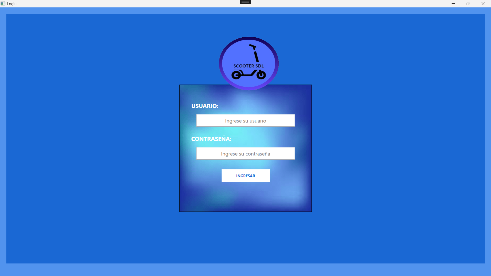
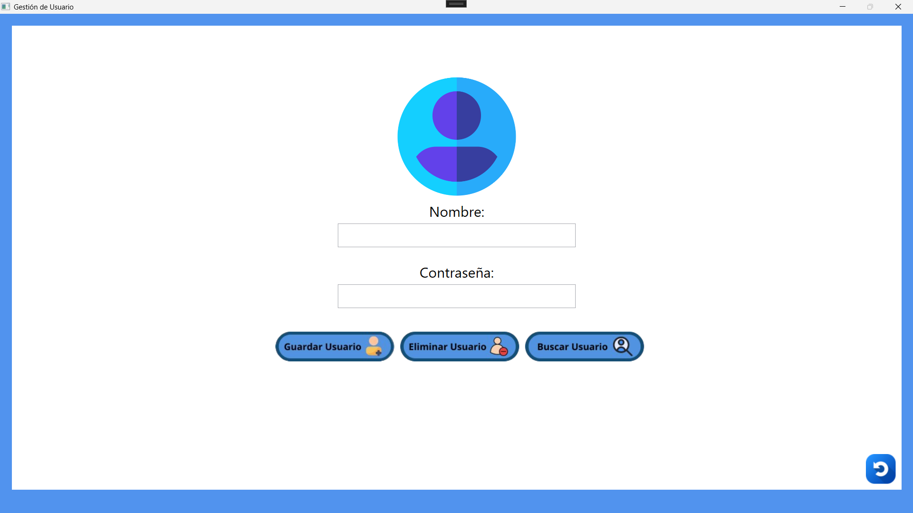
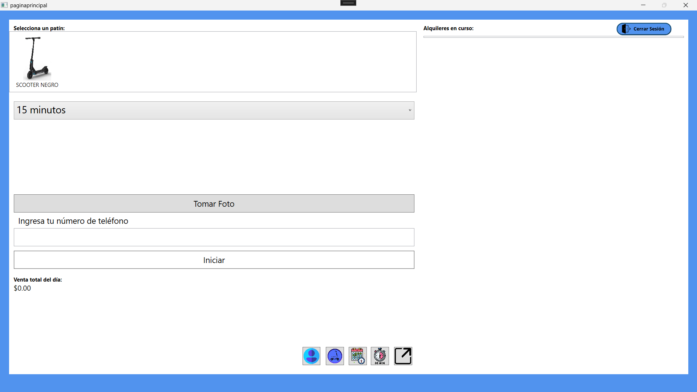
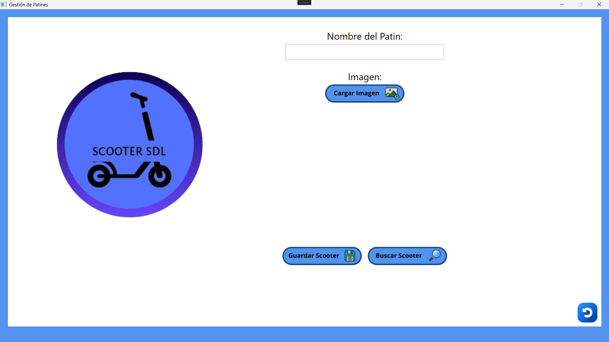
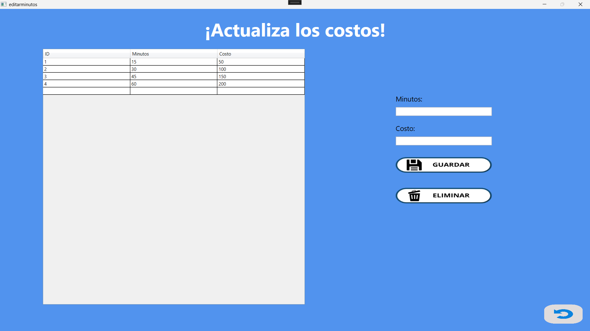

# Alquila-Scooters 🛴

## 📌 Descripción
Alquila-Scooters es una aplicación de escritorio desarrollada en C# con interfaz gráfica que permite gestionar el alquiler de scooters eléctricos. Fue creada como proyecto académico durante la carrera de Ingeniería de Software con el objetivo de aplicar conceptos de programación orientada a objetos, manejo de bases de datos y diseño de interfaces amigables.

La aplicación permite seleccionar un scooter, capturar la información del cliente, tomar una foto de la credencial, calcular el costo del alquiler según tiempo, y generar un resumen visual del alquiler.

---

## 🎯 Objetivo del proyecto
El propósito principal de este sistema es apoyar la gestión de una empresa de alquiler de scooters, automatizando procesos como:

- Registro de alquileres
- Gestión de minutos y costos
- Captura de la identificación del cliente
- Visualización de datos de alquiler
- Interacción con base de datos

Este proyecto forma parte de las actividades académicas de la carrera de Ingeniería de Software, diseñado para poner en práctica técnicas de desarrollo de software con enfoque en experiencia de usuario, lógica de negocio y persistencia de datos.

---

## 🛠️ Tecnologías utilizadas
- **C#** – Lenguaje principal de desarrollo
- **WPF** – Interfaz gráfica
- **SQL Server** – Base de datos
- **XAMPP** – (si aplica) para pruebas locales
- **Git & GitHub** – Control de versiones
- **CustomTkinter / SQLite / Firebase** – (Si aplica según tu diseño final)

> Nota: Ajusta las tecnologías exactas si esto cambia en tu repo.

---

## 🧱 Estructura del proyecto
El repositorio contiene el código fuente del proyecto organizado de forma que separa la lógica de negocio, la presentación y la persistencia de datos.

## ⚙️ Funcionalidades principales

✔ Registro de alquiler de scooters  
✔ Selección de scooter y tiempo de alquiler  
✔ Cálculo automático del costo total  
✔ Captura de imagen de credencial del cliente  
✔ Visualización de detalles del alquiler  
✔ Conexión con base de datos para guardar alquileres  
✔ Interface gráfica amigable y responsiva

---

## 🗄️ Base de datos
El sistema está conectado a **SQL Server** para almacenar registros de alquiler, scooters y clientes.

📌 Incluye scripts para:
- Crear tablas necesarias
- Consultar información de alquileres

> **Nota:** Asegúrate de configurar la cadena de conexión en el proyecto para que funcione correctamente con tu instancia local o servidor.

---

## 📸 Capturas del sistema

### 🔐 Inicio de sesión

### 🧑 Registro / Gestión de usuarios

### 🏠 Menú principal

### 🛴 Gestión de patines

### ⏱️ Selección de minutos

### 📸 Captura de credencial

